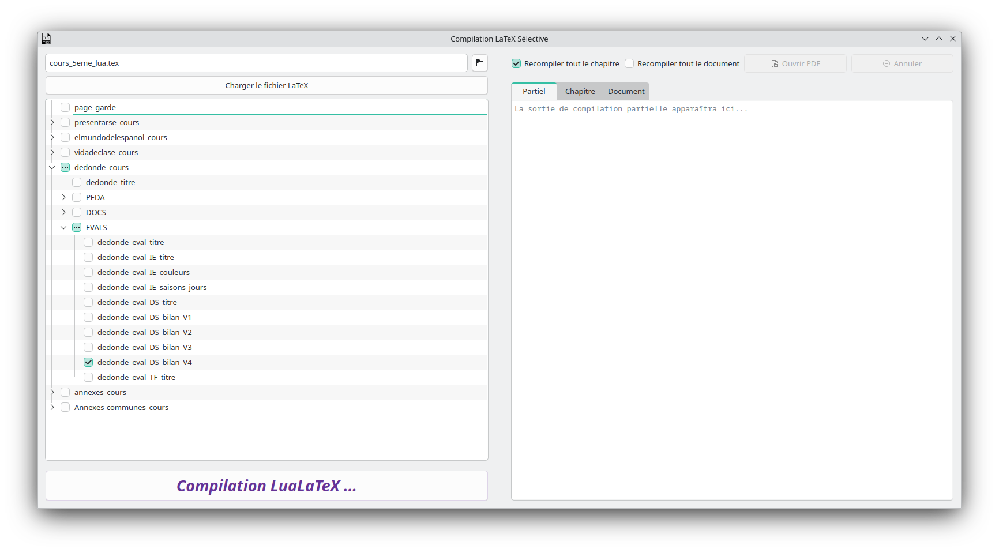

# Compilation LaTeX Sélective

Une application Qt6 pour compiler sélectivement des parties d’un document LaTeX via une interface graphique conviviale.



## 🌟 Fonctionnalités

- **Chargement** interactif de fichiers `.tex`
- **Affichage** de l’arborescence du document avec cases à cocher
- **Compilation partielle** : sections cochées uniquement
- **Recompilation** intégrale du chapitre ou du document complet
- **Sorties** de compilation dans trois onglets (Partiel, Chapitre, Document)
- **Multi-threading** : utilisation de `QThread` pour la compilation séparées des 3 parties
- **Ouverture automatique** du PDF généré (document Partiel)
- **Annulation** de la compilation en cours
- **Sauvegarde** du dernier fichier ouvert et des options de compilation

## 📋 Prérequis

- Qt 6.2 ou supérieur  
- CMake 3.16 ou supérieur  
- Compilateur C++17 compatible (GCC/Clang)  
- Make (version 4.x ou supérieur)  

## 🚀 Installation

1. Cloner le dépôt :
   ```bash
   git clone https://votre-repo/CompilationSelective.git
   cd CompilationSelective
   ```
2. Créer et accéder au répertoire de build :
   ```bash
   mkdir build && cd build
   ```
3. Configurer le projet avec CMake :
   ```bash
   cmake ..
   ```
4. Compiler :
   ```bash
   make -j8
   ```
5. Lancer l’application :
   ```bash
   ./LatexTreeViewer
   ```
   ou via le Makefile racine :
   ```bash
   make run
   ```

## Structure du projet

```
CompilationSelective/
├── build/                        # Répertoire de build généré
├── resources/                    # Ressources Qt (images, lastfile.json)
│   ├── images/                   # Logos et icônes
│   └── lastfile.json             # Dernier fichier ouvert
├── src/                          # Code source C++
│   ├── latexassembler.h/.cpp    
│   ├── latexparser.h/.cpp       
│   ├── latexmodel.h/.cpp        
│   ├── lastfilehelper.h/.cpp    
│   └── processrunner.h/.cpp     
├── CMakeLists.txt                # Configuration CMake
├── Makefile                      # Script de build et gestion
└── main.cpp                      # Point d'entrée de l'application
```

## ⚙️ Utilisation

1. Cliquez sur **Parcourir…** pour sélectionner un fichier `.tex`.  
2. Appuyez sur **Charger le fichier LaTeX** pour afficher l’arborescence.  
3. Cochez les sections à compiler (ou utilisez les cases “Recompiler tout…”).  
4. Sélectionnez les options de compilation (chapitre/document).  
5. Lancez la compilation et suivez la sortie dans les onglets correspondants.  
6. Ouvrez le PDF généré ou annulez la compilation en cours si besoin.